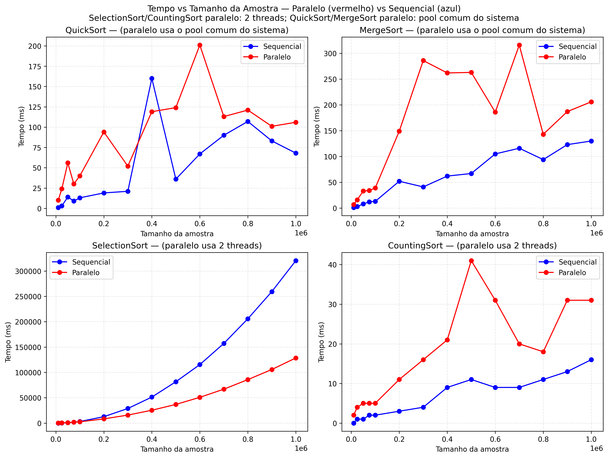

# Link do repositório:
https://github.com/gustavo-sen/parallel-sorting

# Algoritmos de Sorting

Equipe: 
 - Gustavo Abdon
 - Filipe Soares

## QuickSort

> **Tipo:** Divide e Conquista

### Serial
- Escolhe um pivô.
- Particiona o array em dois grupos: menores e maiores que o pivô.
- Resolve recursivamente cada lado.

**Resumo:** Cada chamada recursiva trata uma subparte do array até que esteja completamente ordenado.

### Paralela
- Após o particionamento, os dois lados são **subproblemas independentes**.
- Cada lado pode ser processado **em paralelo**.
- A implementação cria **tarefas recursivas** e as agenda em um **pool de threads**.

**Resultado:** O que antes era uma recursão em profundidade vira duas linhas de execução que avançam simultaneamente, multiplicando-se enquanto houver partições significativas.

---

## MergeSort

> **Tipo:** Divide e Conquista

### Serial
- Divide o array ao meio recursivamente.
- Intercala as metades ordenadas em um vetor temporário.
- Copia de volta para o array original.

**Custo dominante:** a fase de **mesclagem (merge)**.

### Paralela
- As duas metades após uma divisão são **independentes**.
- Cada metade pode ser ordenada **em paralelo** por tarefas recursivas.
- Após o término das duas metades, a **mesclagem** ocorre de modo **sequencial**.

**Benefício:** Reduz o tempo total ao explorar o paralelismo das divisões antes da fase de merge.

---

## SelectionSort

> **Tipo:** Comparativo Simples

### Serial
- Percorre o array posição por posição.
- Para cada posição, busca linearmente o **menor elemento** restante.
- Troca os elementos conforme necessário.

**Complexidade:** O(n²).

### Paralela
- A busca do **menor elemento** pode ser dividida entre várias threads.
- Cada thread encontra um **mínimo local**.
- Os mínimos locais são comparados para obter o **mínimo global**.

**Limitação:** O ganho é pequeno, pois a natureza quadrática do algoritmo não muda.

---

## CountingSort

> **Tipo:** Não comparativo — baseado em contagem

### Serial
- Determina a faixa de valores possíveis.
- Conta a ocorrência de cada valor.
- Reconstrói o array ordenado com base nas contagens.

**Complexidade:** O(n + k), onde *k* é o tamanho da faixa.

### Paralela
- A fase de **contagem** é dividida entre threads, cada uma processando uma parte do array.
- Cada thread gera um **vetor de contagens locais**.
- As contagens são somadas para formar a **contagem global**.
- A reconstrução final é feita de modo **sequencial**.

**Benefício:** Acelera significativamente a fase de contagem.  

## Resultados

Os gráficos a seguir foram gerados a partir dos CSVs em `graphics/data` e comparam o tempo (ms) em função do tamanho da amostra para as versões sequencial (azul) e paralela (vermelho) de cada algoritmo (QuickSort, MergeSort, SelectionSort e CountingSort).

Observação: SelectionSort paralelo e CountingSort paralelo usam 2 threads; QuickSort e MergeSort paralelos usam o pool comum do sistema.

Os resultados indicam que as implementações desenvolvidas, apenas a do InsertionSort teve o melhor desempenho quando executado em paralelo.
O principal motivo é que além da maior parte da execução ser paralelo, as threads não ficavam ociosas durante a sua execução e nem tinham problemas de overhead.
No caso do counting sort, o manejo de cópias de grandes arrays em duas threads além de apenas a primeira parte do processo ser paralelizável não gerou melhorias na execução paralela.
Já para o quicksort e merge sort, a abordagem de substituir a recursão por threads da common pool não se demonstrou eficiente, provavelmente pela soma do overhead com o tempo ocioso de cada threads esperando as threads filhas terminarem.
Talvez uma abordagem que reutilização de threads (como no InsertionSort) possa melhorar o desempenho.

Arquivos disponíveis:
- [PNG](graphics/graphics/speed_vs_sample_size_grid.png)
- [JPG](graphics/graphics/speed_vs_sample_size_grid.jpg)
- [PDF](graphics/graphics/speed_vs_sample_size_grid.pdf)
